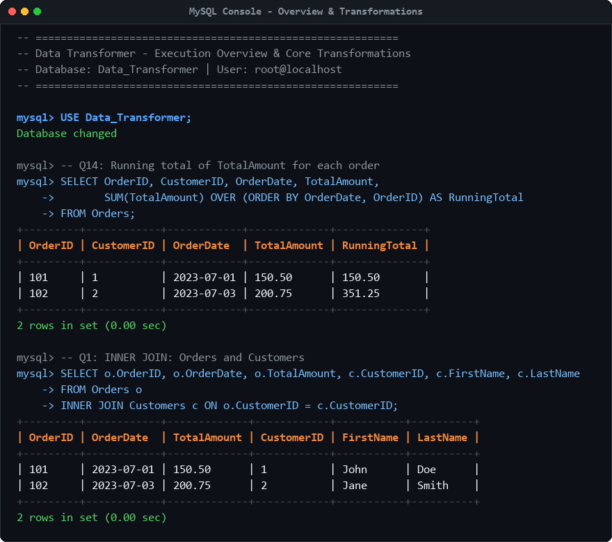
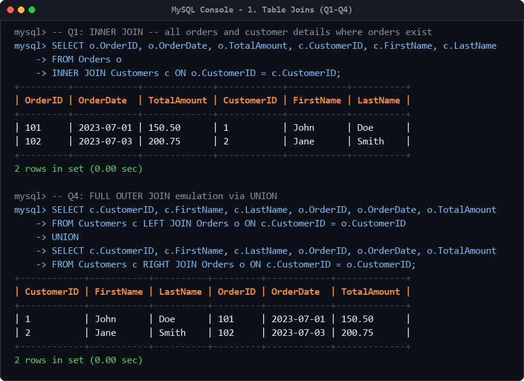
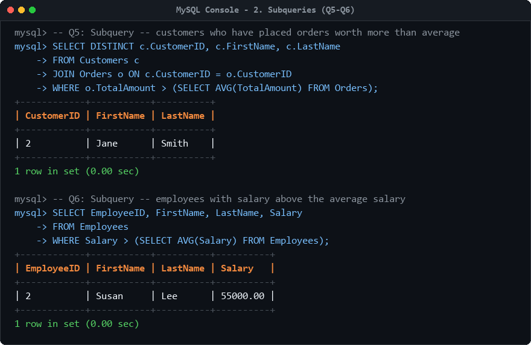
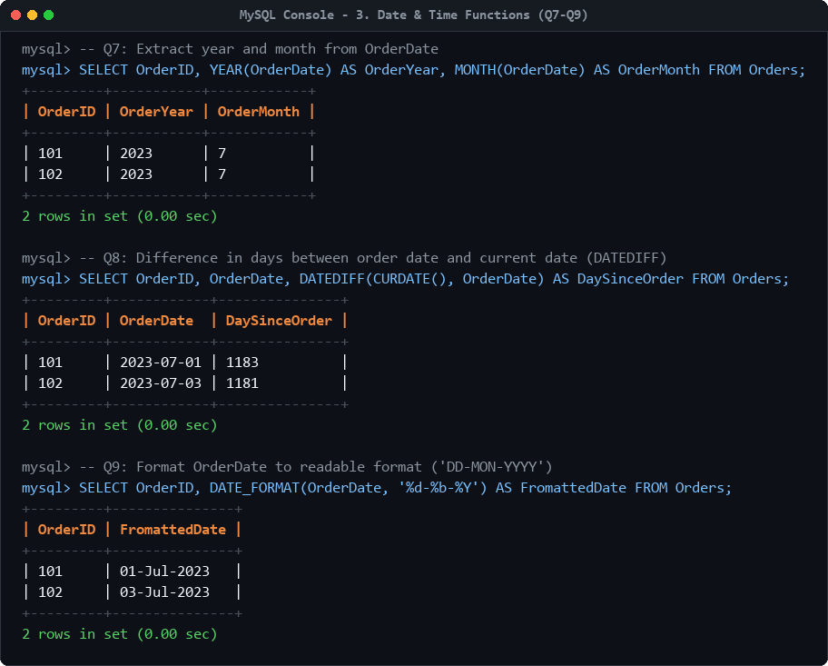
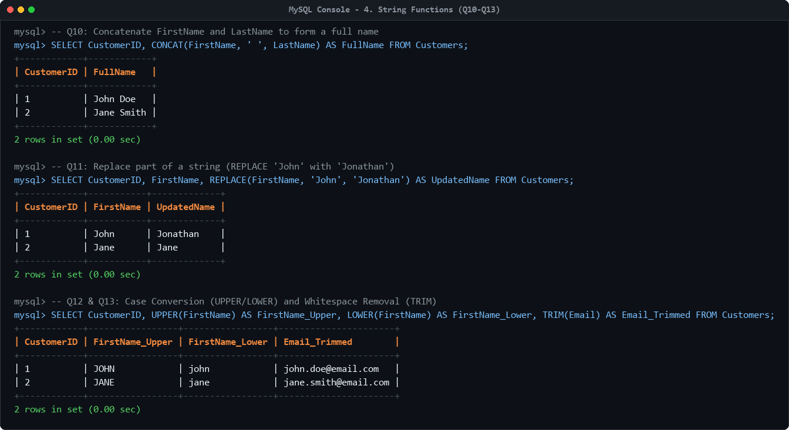
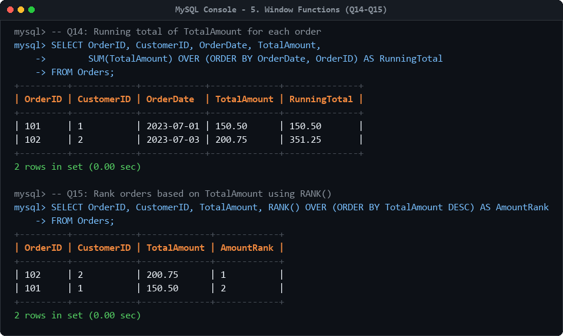
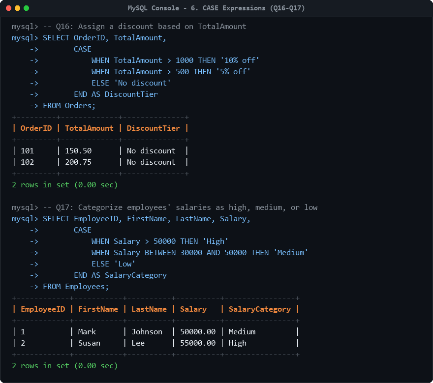

# Data Transformer

A comprehensive MySQL database implementation demonstrating relational schema design, table joins, subqueries, date/time manipulation, string processing, analytical window functions, and conditional CASE logic.



---

## Table of Contents

- [Overview](#overview)
- [Schema & Structure Explanation](#schema--structure-explanation)
- [Tech Stack & Requirements](#tech-stack--requirements)
- [Getting Started & Execution](#getting-started--execution)
- [Features & Operations Covered](#features--operations-covered)
- [Sample Queries & Execution Output](#sample-queries--execution-output)
  - [1. Table Joins (Q1 – Q4)](#1-table-joins-q1--q4)
  - [2. Subqueries (Q5 – Q6)](#2-subqueries-q5--q6)
  - [3. Date & Time Functions (Q7 – Q9)](#3-date--time-functions-q7--q9)
  - [4. String Manipulation Functions (Q10 – Q13)](#4-string-manipulation-functions-q10--q13)
  - [5. Analytical Window Functions (Q14 – Q15)](#5-analytical-window-functions-q14--q15)
  - [6. Conditional CASE Expressions (Q16 – Q17)](#6-conditional-case-expressions-q16--q17)
- [Project Structure](#project-structure)
- [Author](#author)
- [License](#license)

---

## Overview

The **Data Transformer** project (`Data_Transformer`) is designed to showcase core data transformation and querying techniques in SQL. It establishes normalized relational entities for customer profiles, transactional orders, and employee records, and applies 17 targeted SQL operations covering data joining, filtering against subquery aggregations, temporal computation, text cleansing, windowed running totals, and conditional classification.

The single-file script [`DATA TRANSFORMER.sql`](DATA%20TRANSFORMER.sql) contains the complete DDL for database and table creation, sample data seeding, and analytical queries from basic relational joins to advanced window functions.

---

## Schema & Structure Explanation

The database `Data_Transformer` consists of 3 relational tables:

```
+--------------------+               +--------------------+
|     Customers      |               |     Employees      |
+--------------------+               +--------------------+
| PK  CustomerID     |<---+          | PK  EmployeeID     |
|     FirstName      |    |          |     FirstName      |
|     LastName       |    | 1:N      |     LastName       |
|     Email          |    |          |     Department     |
|     RegistrationDate|   |          |     HireDate       |
+--------------------+    |          |     Salary         |
                          |          +--------------------+
                  +-------+----------+
                  |      Orders      |
                  +------------------+
                  | PK  OrderID      |
                  | FK  CustomerID   |
                  |     OrderDate    |
                  |     TotalAmount  |
                  +------------------+
```

### Table Definitions

| Table Name | Primary Key | Foreign Keys | Columns & Data Types | Purpose |
| :--- | :--- | :--- | :--- | :--- |
| **`Customers`** | `CustomerID` | *None* | `CustomerID` (INT), `FirstName` (VARCHAR(50)), `LastName` (VARCHAR(50)), `Email` (VARCHAR(50)), `RegistrationDate` (DATE) | Stores customer demographic data, contact email, and registration date. |
| **`Orders`** | `OrderID` | `CustomerID` &rarr; `Customers(CustomerID)` | `OrderID` (INT), `CustomerID` (INT), `OrderDate` (DATE), `TotalAmount` (DECIMAL(10,2)) | Records customer order transactions and monetary order values. |
| **`Employees`** | `EmployeeID` | *None* | `EmployeeID` (INT), `FirstName` (VARCHAR(50)), `LastName` (VARCHAR(50)), `Department` (VARCHAR(50)), `HireDate` (DATE), `Salary` (DECIMAL(10,2)) | Manages company staff records, departmental assignment, hire dates, and compensation. |

---

## Tech Stack & Requirements

- **Database Engine:** MySQL Server 8.0+ (or MariaDB 10.5+)
- **SQL Dialect:** Standard ANSI SQL / MySQL Dialect
- **Client Tools:** MySQL Command Line Client (`mysql`), MySQL Workbench, or any compatible DBMS interface (DBeaver, VS Code SQLTools)

---

## Getting Started & Execution

### Option 1: Using MySQL Command Line Client

1. Open your terminal or command prompt.
2. Connect to your MySQL server instance:
   ```bash
   mysql -u root -p
   ```
3. Execute the SQL script:
   ```sql
   SOURCE D:/SQL PROJECTS/DATA TRANSFORMER/DATA TRANSFORMER.sql;
   ```
   *(Alternatively, from terminal: `mysql -u root -p < "D:\SQL PROJECTS\DATA TRANSFORMER\DATA TRANSFORMER.sql"`)*

4. Switch to the created database and inspect tables:
   ```sql
   USE Data_Transformer;
   SHOW TABLES;
   ```

### Option 2: Using MySQL Workbench

1. Launch **MySQL Workbench** and establish a connection to your MySQL server.
2. Open the script via **File** &rarr; **Open SQL Script...** and select `DATA TRANSFORMER.sql`.
3. Click the **Execute (Lightning Bolt)** icon to execute the schema definitions, seed data, and queries.
4. Refresh the **Schemas** navigator to inspect `Data_Transformer`.

---

## Features & Operations Covered

The following matrix maps every operation in `DATA TRANSFORMER.sql` to its implementation details:

| Query ID | Category | Operation Description | Clauses / Functions Used | Script Lines |
| :--- | :--- | :--- | :--- | :--- |
| **DDL** | Schema Definition | Create database `Data_Transformer` and tables `Customers`, `Orders`, `Employees` | `CREATE DATABASE IF NOT EXISTS`, `USE`, `CREATE TABLE`, `PRIMARY KEY`, `FOREIGN KEY` | Lines 5–31 |
| **DML** | Data Seeding | Insert representative records into `Customers`, `Orders`, and `Employees` | `INSERT INTO ... VALUES` | Lines 34–44 |
| **Q1** | Joins | Retrieve all matched orders with customer details | `INNER JOIN ... ON` | Lines 46–52 |
| **Q2** | Joins | Query order and customer records via left join | `LEFT JOIN ... ON` | Lines 54–60 |
| **Q3** | Joins | Query all orders with associated customer data | `RIGHT JOIN ... ON` | Lines 62–68 |
| **Q4** | Joins | Full outer join emulation across customers and orders | `LEFT JOIN`, `RIGHT JOIN`, `UNION` | Lines 69–82 |
| **Q5** | Subqueries | Filter customers whose orders exceed the overall average order value | `WHERE ... > (SELECT AVG(...) FROM Orders)` | Lines 84–90 |
| **Q6** | Subqueries | Filter employees whose salary exceeds the company-wide average salary | `WHERE Salary > (SELECT AVG(Salary) FROM Employees)` | Lines 92–96 |
| **Q7** | Date Functions | Extract calendar year and month components from `OrderDate` | `YEAR()`, `MONTH()` | Lines 99–102 |
| **Q8** | Date Functions | Calculate elapsed days from order placement to current date | `DATEDIFF()`, `CURDATE()` | Lines 104–107 |
| **Q9** | Date Functions | Format order date into readable string format (`DD-Mon-YYYY`) | `DATE_FORMAT(..., '%d-%b-%Y')` | Lines 109–112 |
| **Q10** | String Functions | Concatenate first and last names into a combined full name | `CONCAT()` | Lines 114–116 |
| **Q11** | String Functions | Substring replacement on text fields | `REPLACE()` | Lines 119–121 |
| **Q12** | String Functions | Case conversion for text standardization | `UPPER()`, `LOWER()` | Lines 124–126 |
| **Q13** | String Functions | Sanitize text fields by removing leading and trailing whitespace | `TRIM()` | Lines 128–130 |
| **Q14** | Window Functions | Calculate chronological running total of order amounts | `SUM(...) OVER (ORDER BY ...)` | Lines 132–134 |
| **Q15** | Window Functions | Rank orders based on monetary order value in descending order | `RANK() OVER (ORDER BY ... DESC)` | Lines 136–138 |
| **Q16** | CASE Logic | Evaluate order totals and assign tiered discount rates | `CASE WHEN ... THEN ... ELSE ... END` | Lines 140–148 |
| **Q17** | CASE Logic | Classify employee compensation into high, medium, and low bands | `CASE WHEN ... BETWEEN ... END` | Lines 151–160 |

---

## Sample Queries & Execution Output

### 1. Table Joins (Q1 – Q4)

Demonstrates relational data retrieval using `INNER JOIN`, `LEFT JOIN`, `RIGHT JOIN`, and emulated `FULL OUTER JOIN` via `UNION`.

```sql
-- Q1: INNER JOIN -- all orders and customer details where orders exist
SELECT o.OrderID, o.OrderDate, o.TotalAmount, c.CustomerID, c.FirstName, c.LastName 
FROM Orders o
INNER JOIN Customers c ON o.CustomerID = c.CustomerID;

-- Q4: FULL OUTER JOIN emulation via UNION
SELECT c.CustomerID, c.FirstName, c.LastName, o.OrderID, o.OrderDate, o.TotalAmount
FROM Customers c 
LEFT JOIN Orders o ON c.CustomerID = o.CustomerID
UNION 
SELECT c.CustomerID, c.FirstName, c.LastName, o.OrderID, o.OrderDate, o.TotalAmount
FROM Customers c
RIGHT JOIN Orders o ON c.CustomerID = o.CustomerID;
```



---

### 2. Subqueries (Q5 – Q6)

Applies scalar subqueries within the `WHERE` clause to filter datasets dynamically against aggregated benchmarks.

```sql
-- Q5: Customers who have placed orders worth more than average
SELECT DISTINCT c.CustomerID, c.FirstName, c.LastName 
FROM Customers c
JOIN Orders o ON c.CustomerID = o.CustomerID 
WHERE o.TotalAmount > (SELECT AVG(TotalAmount) FROM Orders);

-- Q6: Employees with salary above the average salary
SELECT EmployeeID, FirstName, LastName, Salary 
FROM Employees 
WHERE Salary > (SELECT AVG(Salary) FROM Employees);
```



---

### 3. Date & Time Functions (Q7 – Q9)

Performs component extraction, interval duration calculation using `DATEDIFF()`, and custom date formatting.

```sql
-- Q7: Extract year and month from OrderDate
SELECT OrderID, YEAR(OrderDate) AS OrderYear, MONTH(OrderDate) AS OrderMonth
FROM Orders;

-- Q8: Difference in days between order date and current date
SELECT OrderID, OrderDate, DATEDIFF(CURDATE(), OrderDate) AS DaySinceOrder
FROM Orders;

-- Q9: Format OrderDate to readable format ('DD-Mon-YYYY')
SELECT OrderID, DATE_FORMAT(OrderDate, "%d-%b-%Y") AS FromattedDate
FROM Orders;
```



---

### 4. String Manipulation Functions (Q10 – Q13)

Demonstrates text formatting, substring replacement, casing conversion, and whitespace sanitization.

```sql
-- Q10: Concatenate FirstName and LastName
SELECT CustomerID, CONCAT(FirstName, " ", LastName) AS FullName FROM Customers;

-- Q11: Replace part of a string
SELECT CustomerID, FirstName, REPLACE(FirstName, "John", "Jonathan") AS UpdatedName FROM Customers;

-- Q12: Convert FirstName to uppercase and lowercase
SELECT CustomerID, UPPER(FirstName) AS FirstName_Upper, LOWER(FirstName) AS FirstName_Lower FROM Customers;

-- Q13: Trim extra spaces from the Email field
SELECT CustomerID, Email, TRIM(Email) AS Email_Trimmed FROM Customers;
```



---

### 5. Analytical Window Functions (Q14 – Q15)

Computes cumulative running metrics and comparative rankings over ordered result sets.

```sql
-- Q14: Running total of TotalAmount for each order
SELECT OrderID, CustomerID, OrderDate, TotalAmount,
       SUM(TotalAmount) OVER (ORDER BY OrderDate, OrderID) AS RunningTotal
FROM Orders;

-- Q15: Rank orders based on TotalAmount using RANK()
SELECT OrderID, CustomerID, TotalAmount,
       RANK() OVER (ORDER BY TotalAmount DESC) AS AmountRank
FROM Orders;
```



---

### 6. Conditional CASE Expressions (Q16 – Q17)

Applies branching conditional logic to categorize transactions and employee salaries.

```sql
-- Q16: Assign a discount based on TotalAmount
SELECT OrderID, TotalAmount,
       CASE 
           WHEN TotalAmount > 1000 THEN "10% off"
           WHEN TotalAmount > 500 THEN "5% off"
           ELSE "No discount"
       END AS DiscountTier
FROM Orders;

-- Q17: Categorize employees' salaries as high, medium, or low
SELECT EmployeeID, FirstName, LastName, Salary,
       CASE 
           WHEN Salary > 50000 THEN "High"
           WHEN Salary BETWEEN 30000 AND 50000 THEN "Medium"
           ELSE "Low"
       END AS SalaryCategory
FROM Employees;
```



---

## Project Structure

```
DATA TRANSFORMER/
├── DATA TRANSFORMER.sql          # Complete SQL script (DDL, DML, Queries Q1–Q17)
├── README.md                     # Project documentation & execution guide
└── screenshots/                  # Verified query execution captures
    ├── sample_output.png         # Top overview preview
    ├── 01_joins.png              # Q1–Q4 Joins output
    ├── 02_subqueries.png         # Q5–Q6 Subqueries output
    ├── 03_date_functions.png     # Q7–Q9 Date functions output
    ├── 04_string_functions.png   # Q10–Q13 String functions output
    ├── 05_window_functions.png   # Q14–Q15 Window functions output
    └── 06_case_expressions.png   # Q16–Q17 CASE expressions output
```

---

## Author

- **GitHub:** [@rudhiyansh](https://github.com/rudhiyansh)

---

## License

This project is licensed under the MIT License.
